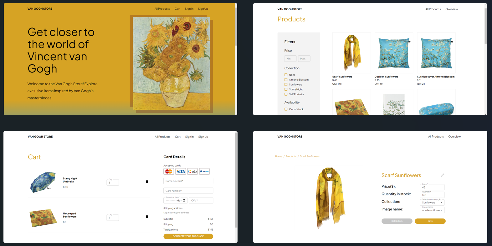
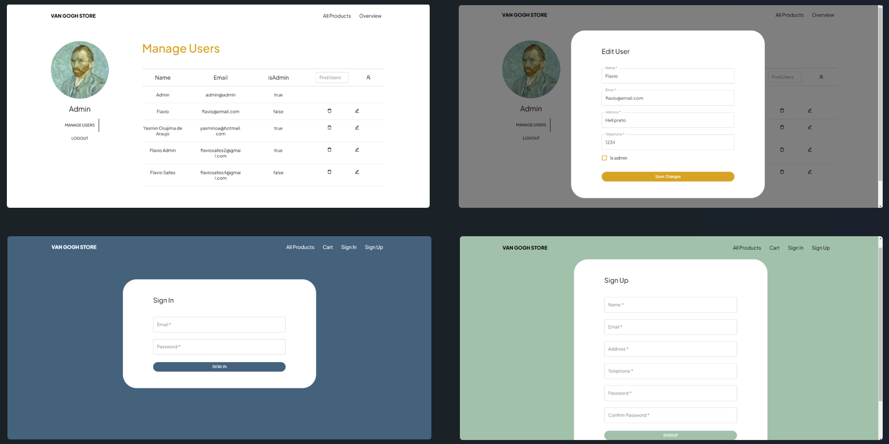
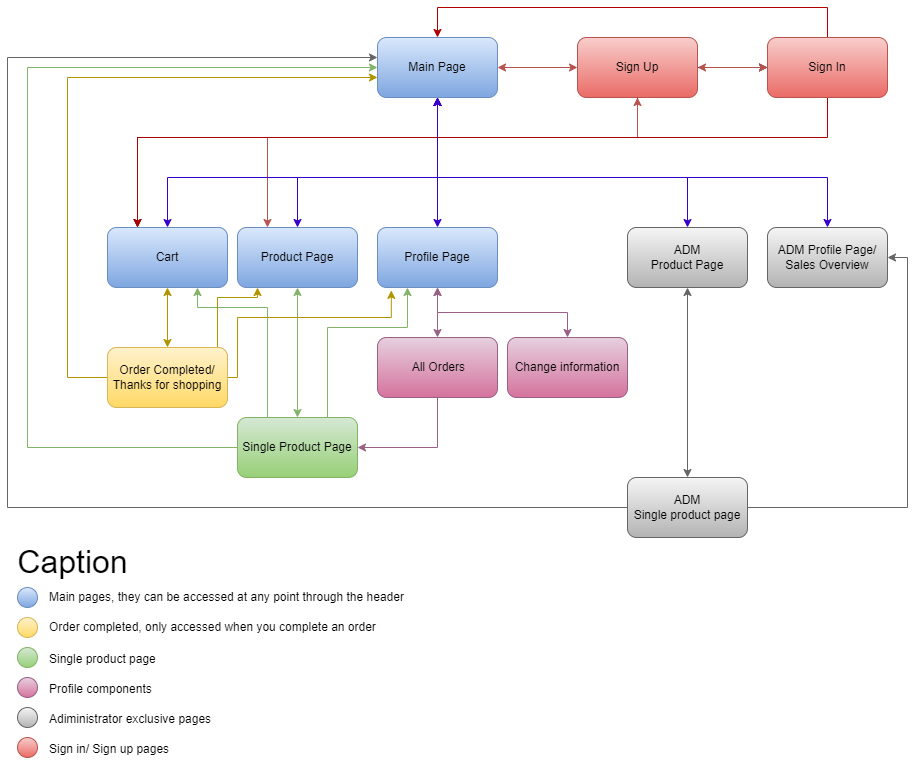

# Project Report
11218809 Flavio Salles <br>
14609637 Tiago Chaves Bezerra Rocha <br>
11219004 Yasmin Osajima de Araujo

This is the project of an Online Store for Web Development Introduction class, 2023, ICMC-USP, São Carlos, Brazil.

## Requirements
This project requires the following base requirements: React, HTML, CSS, JavaScript, Node, and MongoDB.
We also used the design system Material UI.

## Project Description
The project consists on a Van Gogh e-commerce website, an online store that specializes in selling products related to the famous painter, Vincent Van Gogh. The website offers a wide range of products including printings, mugs, toys, and other kinds of decoration.


The user will be able to browse and filter products by collection or price, add products to their cart, and view the total price of their purchase. They will then be able to checkout and complete their purchase by entering their payment method information. The user can also access their profile page, update their personal information, such as address and telephone, and check their order details.


The website owner will have access to an admin panel where they can view statistics such as total sales, amount of sold products, and revenue. They will also be able to add/edit the products and users.


Information to be saved on the server includes client data (name, email, phone, address, password, isAdmin), product data (name, quantity in stock, price, picture, collection), and order data (id, client, products, payment method, total price, timestamp).


The project pages are: main page, product page, cart, sign in, sign up, profile page (with three sections: all orders made, profile information, and profile picture), single product page, order completed page, administrator product page, administrator sales overview page, administrator single product page and administrator manage users page. 


The screen mockups for the website can be found on [Figma](https://www.figma.com/file/4SYAvVb0Y8XL6viOJ67HNA/OnlineStoreMockup?type=design&node-id=0%3A1&t=ur51hlypofs9jZOS-1) <br><br>


The diagram navigation can be found below:<br><br>


## Comments About the Code
We have developed the project using React, CSS, and JavaScript. The backend data for the products and users informations is stored in cloud using MongoDB. Data such as cart or login session, that don't need to be persistent is stored in the browser's local storage.

## Test Plan
**GENERAL INPUTS**
- Strictly numeric fields such as phone, the quantity of products, price filters, card number, or CVV should not allow the addition of letters or special characters in their values.
  
**LOGIN/LOGOUT**
- When creating an account with an invalid email (without @) or missing required fields, the application should notify that the specific fields are incorrect. If different values are entered for the password and confirm password fields, an alert is generated notifying that the fields do not match.
- When attempting to log in with an invalid password or email, an error alert should be generated by the application.
- When clicking to log out, the user should be logged out and all session data should be deleted, including the shopping cart.
  
**SHOPPING CART**
- While logged out, it is possible to add products to a shopping cart. Upon logging into an account, the products should be saved in the cart so that the purchase can be completed.
- When attempting to make a purchase while logged out, the purchase should not be completed, and an alert instructing to log in should be generated.
- If an attempt is made to add more products to the cart than the current quantity in stock, an alert for the stock limit should be generated by the application.
- In the shopping cart, it is possible to change the quantity of products to be purchased. If this quantity exceeds the stock limit, an alert should be generated, and the purchase cannot be completed.
- In case of attempting to make a purchase with an empty cart, an alert should also be generated.

**HEADER**
- When logging in as a regular customer, the header should be updated to allow access to the Account page.
- When clicking on the store logo in the header, the user should be redirected to the home page.

**MAIN**
- When clicking on the arrows present in the main section, the user should be redirected to the product page with the corresponding collection filter applied.

**PRODUCTS**
- When selecting or entering values in the filter fields on the product page, the displayed list of products should be immediately updated.
- If no collection is selected in the product page filters, then all available products from all collections should be displayed.
- When making a purchase, the displayed stock quantity of the products should be updated.

**ACCOUNT**
- Upon opening the user information page, all their data should be loaded into the fields, allowing and saving any edits made.
- On the profile picture update page, the user should be able to see the currently selected photo as their profile picture.
- The user should be able to update the profile picture and see the changes instantly.

**ADMIN**
- When logging in as an administrator, the header should be updated to reflect the pages that can be accessed with this permission.
- When opening the product page as an administrator, it should be possible to view the filter to show products that are out of stock.
- As an administrator, it should be possible to edit the registered information when clicking on products.
- When opening the product page as an administrator, it should be possible to view and activate the button to create a new product.

## Test Results
Following the steps described in the test plan, it is possible to analyze the correct functioning of all functionalities as changes in the project are made.
As a result, we have a project that passes all the tests, ensuring that all the points above are being fulfilled.

## Build Procedures
1. **Install Node.js**: You can download and install Node.js at https://nodejs.org
2. **Navigate to the project directory**: Use the `cd` command to navigate into the project directory: `cd project-directory`
3. **Install dependencies**: In the project directory, use the following command to install the required dependencies: `npm install`
4. **Build the project**: Once the dependencies are installed, use the following command: `npm run build`
5. **Run the project**: After completing the build process, use the following command: `npm start`
6. **Run the server**: In another terminal, run the following command to setup the server: ``npm run server`

## Problems
No major problems were found during the development of the project.

## Comments
To access the admin panel, use the following credentials:

```
Email: admin@admin
Password: admin
```
